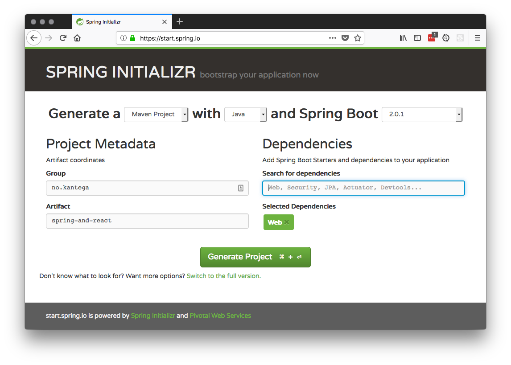
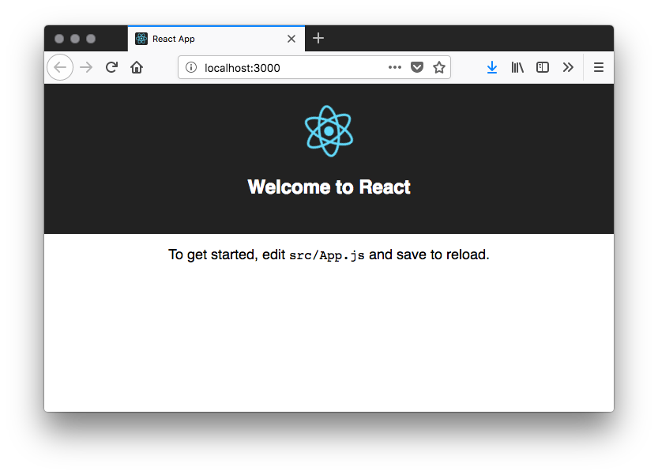
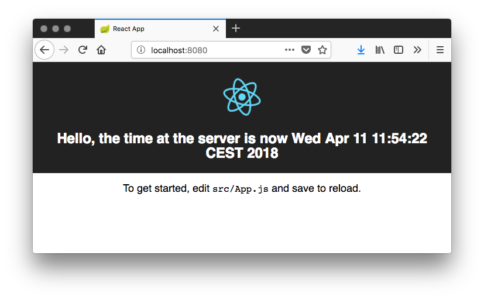

Webapp with Create React App and Spring Boot
===

Developing Spring applications with Spring Boot is a real time saver. It gets you up and running quickly, and 
continues to make your life easier as you move to production and start releasing incremental updates to your
application. 

Create React App does the same thing for your React frontend. It speeds up the initial phase by stitching together
everything you need to get your React frontend working with minimal effort on your part, and it shortens your feedback
loop by enabling hot reload. That way, you can just save your files, and changes will be immediately visible in 
the browser. 

This tutorial shows you how to combine Create React App with Spring Boot, giving you one single jar file to deploy.

## Goal:
 - Easily deploy to test and production environments
 - Frontend and backend in a single jar
 - Keep the benefits using the Create React App environment including:
    - Hot reload
    - Built in ES6 to ES5 transpiler
    - Optimized production build

## Getting started
First, create a spring boot project with https://start.spring.io. Add the `Web` dependency. Set the groupId and
artifactId to whatever you want. In this example we chose `no.kantega` and `spring-and-react`. 



Generate the project and unzip it into your project directory. You probably want to initialize git, add a .gitignore
and make your initial commit at this point. 

You should now have a project with a pom that looks something like this: 

```xml
<?xml version="1.0" encoding="UTF-8"?>
<project xmlns="http://maven.apache.org/POM/4.0.0" xmlns:xsi="http://www.w3.org/2001/XMLSchema-instance"
         xsi:schemaLocation="http://maven.apache.org/POM/4.0.0 http://maven.apache.org/xsd/maven-4.0.0.xsd">
    <modelVersion>4.0.0</modelVersion>

    <groupId>no.kantega</groupId>
    <artifactId>spring-and-react</artifactId>
    <version>0.0.1-SNAPSHOT</version>
    <packaging>jar</packaging>

    <name>spring-and-react</name>
    <description>Demo project for Spring Boot</description>

    <parent>
        <groupId>org.springframework.boot</groupId>
        <artifactId>spring-boot-starter-parent</artifactId>
        <version>2.0.1.RELEASE</version>
        <relativePath/> <!-- lookup parent from repository -->
    </parent>

    <properties>
        <project.build.sourceEncoding>UTF-8</project.build.sourceEncoding>
        <project.reporting.outputEncoding>UTF-8</project.reporting.outputEncoding>
        <java.version>1.8</java.version>
    </properties>

    <dependencies>
        <dependency>
            <groupId>org.springframework.boot</groupId>
            <artifactId>spring-boot-starter-web</artifactId>
        </dependency>

        <dependency>
            <groupId>org.springframework.boot</groupId>
            <artifactId>spring-boot-starter-test</artifactId>
            <scope>test</scope>
        </dependency>
    </dependencies>

    <build>
        <plugins>
            <plugin>
                <groupId>org.springframework.boot</groupId>
                <artifactId>spring-boot-maven-plugin</artifactId>
            </plugin>
        </plugins>
    </build>
</project>
```

Right now, there are no services in this app, so if you were to run it and navigate to http://localhost:8080, you 
would only get a 404 page. So let's add a controller called `no.kantega.springandreact.HelloController`: 

```java
package no.kantega.springandreact;

import org.springframework.web.bind.annotation.GetMapping;
import org.springframework.web.bind.annotation.RestController;

import java.util.Date;

@RestController
public class HelloController {
    @GetMapping("/api/hello")
    public String hello() {
        return "Hello, the time at the server is now " + new Date() + "\n";
    }
}
```

Now, let's run the application and try it out: 

In one command line window, start the application with 
```
$ mvn spring-boot:run 

[...]
2018-04-11 09:35:47.566  INFO 88567 --- [           main] o.s.b.w.embedded.tomcat.TomcatWebServer  : Tomcat started on port(s): 8080 (http) with context path ''
2018-04-11 09:35:47.573  INFO 88567 --- [           main] n.k.s.SpringAndReactApplication          : Started SpringAndReactApplication in 2.295 seconds (JVM running for 5.486)
2018-04-11 09:35:49.837  INFO 88567 --- [nio-8080-exec-1] o.a.c.c.C.[Tomcat].[localhost].[/]       : Initializing Spring FrameworkServlet 'dispatcherServlet'
2018-04-11 09:35:49.838  INFO 88567 --- [nio-8080-exec-1] o.s.web.servlet.DispatcherServlet        : FrameworkServlet 'dispatcherServlet': initialization started
2018-04-11 09:35:49.853  INFO 88567 --- [nio-8080-exec-1] o.s.web.servlet.DispatcherServlet        : FrameworkServlet 'dispatcherServlet': initialization completed in 15 ms
```

Then, in another window, fetch http://localhost:8080/api/hello with curl or your web browser: 

```
$ curl http://localhost:8080/api/hello
Hello, the time at the server is now Wed Apr 11 09:38:19 CEST 2018
```

That's great, we now have a rest service in Spring Boot up and running!

## Adding React

This section uses the tool [npx](https://medium.com/@maybekatz/introducing-npx-an-npm-package-runner-55f7d4bd282b), 
which is included with newer versions of `npm`. 

```
$ npx create-react-app frontend

Creating a new React app in /Users/oven/git/react-and-spring/frontend.

Installing packages. This might take a couple of minutes.
Installing react, react-dom, and react-scripts...
[...]
Success! Created frontend at /Users/oven/git/react-and-spring/frontend
[...]
We suggest that you begin by typing:

  cd frontend
  npm start
```

OK, let's do that, then :) 

```
$ cd frontend
$ npm start

[...] 

Compiled successfully!

You can now view frontend in the browser.

  Local:            http://localhost:3000/
  On Your Network:  http://172.16.25.84:3000/

Note that the development build is not optimized.
To create a production build, use npm run build.
```

This will open a web browser on your desktop, and it should display something like this: 



## Calling rest services in spring from React
Now we have a backend server in Spring Boot running at http://localhost:8080 and a frontend frontend in
React running at http://localhost:3000. We'd like to be able to call services in the backend and
display the results in the frontend. In order to do this (and not get into trouble with any
cross-origin requests (CORS)) we ask the frontend server to proxy any requests from `:3000` to `:8080`. 

According to the
[documentation](https://github.com/facebook/create-react-app/blob/master/packages/react-scripts/template/README.md#configuring-the-proxy-manually)
you have to add a `proxy` entry to `frontend/package.json`. This will ensure that the web server at :3000 proxies 
any requests to `http://localhost:3000/api/*` to `http://localhost:8080/api`, which will enable us
to call the backend without running into any CORS issues. Note that this is only useful during
development. In a test or production environment, we will solve this in a different way. Read on :)

`frontend/package.json` 
```json
{
  "name": "frontend",
  "version": "0.1.0",
  "private": true,
  "dependencies": {
    "react": "^16.3.1",
    "react-dom": "^16.3.1",
    "react-scripts": "1.1.4"
  },
  "scripts": {
    "start": "react-scripts start",
    "build": "react-scripts build",
    "test": "react-scripts test --env=jsdom",
    "eject": "react-scripts eject"
  },
  "proxy": {
    "/api": {
      "target": "http://localhost:8080",
      "ws": true
    }
  }
}
```

Make sure you have the backend running, and restart the frontend. You should now be able to fetch
the hello service through the frontend server at http://localhost:3000/api/hello

```
$ curl http://localhost:3000/api/hello
Hello, the time at the server is now Wed Apr 11 10:04:47 CEST 2018
```

Next, let's add a rest call to the frontend: 

Open `frontend/src/App.js` and replace its contents with this: 

```javascript
import React, {Component} from 'react';
import logo from './logo.svg';
import './App.css';

class App extends Component {

    state = {};

    componentDidMount() {
        setInterval(this.hello, 250);
    }

    hello = () => {
        fetch('/api/hello')
            .then(response => response.text())
            .then(message => {
                this.setState({message: message});
            });
    };

    render() {
        return (
            <div className="App">
                <header className="App-header">
                    
                    <h1 className="App-title">{this.state.message}</h1>
                </header>
                <p className="App-intro">
                    To get started, edit <code>src/App.js</code> and save to reload.
                </p>
            </div>
        );
    }
}

export default App;
```

The frontend should now display the current time at the server: 


Success! We now have a React frontend that talks to our Spring Boot backend. But how do we deploy
this to production? 

## Packaging the React app with Spring Boot
We'd like to be able to publish *one* jar file to production, and that jar file should
contain both the backend and the frontend. Spring Boot applications can serve static content if you put
it into the `classes/public` directory of the application jar file. Create React App can build a 
static bundle for production by running `npm build` in the frontend directory.

To accomplish this, we have to do the following: 
 
   1. create a production build of the frontend 
   2. copy the production build into `${target/classes/public}`

We'll use `frontend-maven-plugin` in step 1, and `maven-antrun-plugin` in step 2. When we're done, 
we can just type `$ mvn clean install` and we'll end up with a single jar file containing both
the frontend and the backend. 

### Run npm from maven
Add the following to `pom.xml` under `/build/plugins`:  
```xml
<plugin>
    <groupId>com.github.eirslett</groupId>
    <artifactId>frontend-maven-plugin</artifactId>
    <version>1.6</version>
    <configuration>
        <workingDirectory>frontend</workingDirectory>
        <installDirectory>target</installDirectory>
    </configuration>
    <executions>
        <execution>
            <id>install node and npm</id>
            <goals>
                <goal>install-node-and-npm</goal>
            </goals>
            <configuration>
                <nodeVersion>v8.9.4</nodeVersion>
                <npmVersion>5.6.0</npmVersion>
            </configuration>
        </execution>
        <execution>
            <id>npm install</id>
            <goals>
                <goal>npm</goal>
            </goals>
            <configuration>
                <arguments>install</arguments>
            </configuration>
        </execution>
        <execution>
            <id>npm run build</id>
            <goals>
                <goal>npm</goal>
            </goals>
            <configuration>
                <arguments>run build</arguments>
            </configuration>
        </execution>
    </executions>
</plugin>
```

When you run `mvn clean install`, maven will install npm and node locally and run `npm build`
in the `frontend` directory. 

```
$ mvn clean install
[...]

[INFO] Installed node locally.
[INFO] Installing npm version 5.6.0
[INFO] Unpacking /Users/oven/.m2/repository/com/github/eirslett/npm/5.6.0/npm-5.6.0.tar.gz into /Users/oven/git/react-and-spring/target/node/node_modules
[INFO] Installed npm locally.
[INFO]
[INFO] --- frontend-maven-plugin:1.6:npm (npm install) @ spring-and-react ---
[INFO] Running 'npm install' in /Users/oven/git/react-and-spring/frontend
[WARNING] npm WARN ajv-keywords@3.1.0 requires a peer of ajv@^6.0.0 but none is installed. You must install peer dependencies yourself.
[ERROR]
[INFO] up to date in 7.23s
[INFO]
[INFO] --- frontend-maven-plugin:1.6:npm (npm run build) @ spring-and-react ---
[INFO] Running 'npm run build' in /Users/oven/git/react-and-spring/frontend
[INFO]
[INFO] > frontend@0.1.0 build /Users/oven/git/react-and-spring/frontend
[INFO] > react-scripts build
[INFO]
[INFO] Creating an optimized production build...
[INFO] Compiled successfully.
[...]
```

This results in a production build of the frontend in `frontend/build`: 

```
$ tree frontend/build
frontend/build
├── asset-manifest.json
├── favicon.ico
├── index.html
├── manifest.json
├── service-worker.js
└── static
    ├── css
    │   ├── main.c17080f1.css
    │   └── main.c17080f1.css.map
    ├── js
    │   ├── main.9980f700.js
    │   └── main.9980f700.js.map
    └── media
        └── logo.5d5d9eef.svg

4 directories, 10 files
```

### Include frontend build files in spring boot jar
We now have to copy these files to `target/classes/public` in order to serve them as static resources
from the Spring Boot application. We'll use the ant plugin for this. 

Add the following to `pom.xml` under `/build/plugins`: 

```xml
 <plugin>
    <artifactId>maven-antrun-plugin</artifactId>
    <executions>
        <execution>
            <phase>generate-resources</phase>
            <configuration>
                <target>
                    <copy todir="${project.build.directory}/classes/public">
                        <fileset dir="${project.basedir}/frontend/build"/>
                    </copy>
                </target>
            </configuration>
            <goals>
                <goal>run</goal>
            </goals>
        </execution>
    </executions>
</plugin>
``` 

This will ensure that the frontend build files are copied after they have been generated by `npm build`.

Run maven again, and inspect the contents of the `target/classes` directory: 

```
$ mvn clean install
[...]

[INFO] --- maven-antrun-plugin:1.8:run (default) @ spring-and-react ---
[INFO] Executing tasks

main:
     [copy] Copying 10 files to /Users/oven/git/react-and-spring/target/classes/public
[INFO] Executed tasks

[...] 

$ tree target/classes
  target/classes
  ├── application.properties
  ├── no
  │   └── kantega
  │       └── springandreact
  │           ├── HelloController.class
  │           └── SpringAndReactApplication.class
  └── public
      ├── asset-manifest.json
      ├── favicon.ico
      ├── index.html
      ├── manifest.json
      ├── service-worker.js
      └── static
          ├── css
          │   ├── main.c17080f1.css
          │   └── main.c17080f1.css.map
          ├── js
          │   ├── main.9980f700.js
          │   └── main.9980f700.js.map
          └── media
              └── logo.5d5d9eef.svg
  
  8 directories, 13 files
```

You should also check that the files are present in the resulting jar file: 

```  
$ jar tvf target/spring-and-react-0.0.1-SNAPSHOT.jar | grep public
     0 Wed Apr 11 11:50:14 CEST 2018 BOOT-INF/classes/public/
     0 Wed Apr 11 11:50:14 CEST 2018 BOOT-INF/classes/public/static/
     0 Wed Apr 11 11:50:14 CEST 2018 BOOT-INF/classes/public/static/css/
     0 Wed Apr 11 11:50:14 CEST 2018 BOOT-INF/classes/public/static/js/
     0 Wed Apr 11 11:50:14 CEST 2018 BOOT-INF/classes/public/static/media/
494612 Wed Apr 11 11:50:14 CEST 2018 BOOT-INF/classes/public/static/js/main.9980f700.js.map
  3235 Wed Apr 11 11:50:14 CEST 2018 BOOT-INF/classes/public/service-worker.js
123322 Wed Apr 11 11:50:14 CEST 2018 BOOT-INF/classes/public/static/js/main.9980f700.js
   650 Wed Apr 11 11:50:14 CEST 2018 BOOT-INF/classes/public/static/css/main.c17080f1.css
  2671 Wed Apr 11 11:50:14 CEST 2018 BOOT-INF/classes/public/static/media/logo.5d5d9eef.svg
  1288 Wed Apr 11 11:50:14 CEST 2018 BOOT-INF/classes/public/static/css/main.c17080f1.css.map
  3870 Wed Apr 11 11:50:14 CEST 2018 BOOT-INF/classes/public/favicon.ico
   257 Wed Apr 11 11:50:14 CEST 2018 BOOT-INF/classes/public/asset-manifest.json
   548 Wed Apr 11 11:50:14 CEST 2018 BOOT-INF/classes/public/index.html
   317 Wed Apr 11 11:50:14 CEST 2018 BOOT-INF/classes/public/manifest.json
```

Now, we're ready to start the application. Make sure you quit any running servers, and run the
jar file 

```
$ java -jar target/spring-and-react-0.0.1-SNAPSHOT.jar


  .   ____          _            __ _ _
 /\\ / ___'_ __ _ _(_)_ __  __ _ \ \ \ \
( ( )\___ | '_ | '_| | '_ \/ _` | \ \ \ \
 \\/  ___)| |_)| | | | | || (_| |  ) ) ) )
  '  |____| .__|_| |_|_| |_\__, | / / / /
 =========|_|==============|___/=/_/_/_/
 :: Spring Boot ::        (v2.0.1.RELEASE)

2018-04-11 11:53:44.983  INFO 93434 --- [           main] n.k.s.SpringAndReactApplication          : Starting SpringAndReactApplication v0.0.1-SNAPSHOT on oven.local with PID 93434 (/Users/oven/git/react-and-spring/target/spring-and-react-0.0.1-SNAPSHOT.jar started by oven in /Users/oven/git/react-and-spring)
2018-04-11 11:53:44.986  INFO 93434 --- [           main] n.k.s.SpringAndReactApplication          : No active profile set, falling back to default profiles: default
2018-04-11 11:53:45.045  INFO 93434 --- [           main] ConfigServletWebServerApplicationContext : Refreshing org.springframework.boot.web.servlet.context.AnnotationConfigServletWebServerApplicationContext@5af3afd9: startup date [Wed Apr 11 11:53:45 CEST 2018]; root of context hierarchy
2018-04-11 11:53:46.180  INFO 93434 --- [           main] o.s.b.w.embedded.tomcat.TomcatWebServer  : Tomcat initialized with port(s): 8080 (http)
2018-04-11 11:53:46.221  INFO 93434 --- [           main] o.apache.catalina.core.StandardService   : Starting service [Tomcat]
2018-04-11 11:53:46.222  INFO 93434 --- [           main] org.apache.catalina.core.StandardEngine  : Starting Servlet Engine: Apache Tomcat/8.5.29
[...]
2018-04-11 11:53:47.039  INFO 93434 --- [           main] o.s.b.w.embedded.tomcat.TomcatWebServer  : Tomcat started on port(s): 8080 (http) with context path ''
[...]
```

Open your web browser, and navigate to http://localhost:8080. You should now see the following: 



## Congratulations!

You now have a spring boot application with a React frontend. During development, you can now run the application
using `React-scripts` by running `cd frontend; npm start`, and you'll have all the benefits of rapid application 
development with hot reloads and everything you might wish for, while being able to deploy the application to test
and production environments as a single artifact. 

Happy hacking!

